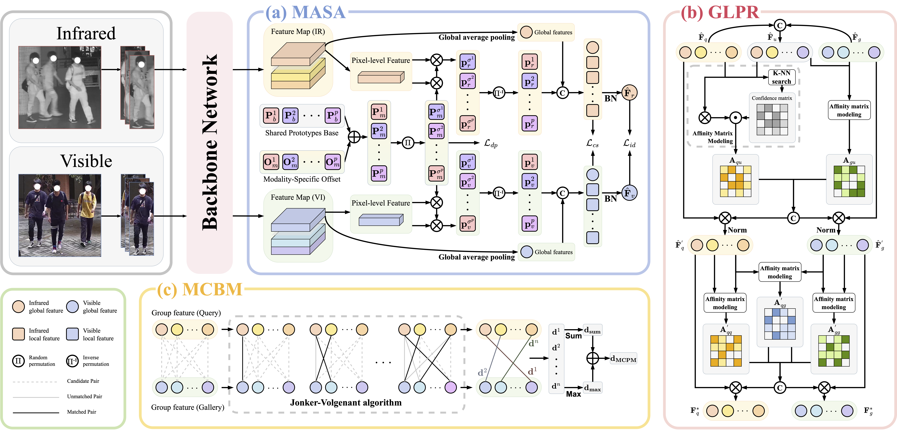

# PRISM

Official implementation for **PRISM: PROPAGATING-BASED REFINED SEMANTIC FEATURES WITH BIPARTITE MATCHING FOR VISIBLE-INFRARED GROUP RE-IDENTIFICATION**.



## Datasets

Prepare each dataset manually and update the local paths before training or evaluation.

- SYSU-MM01: https://github.com/wuancong/SYSU-MM01
- RegDB: http://dm.dongguk.edu/link.html
- LLCM: https://github.com/ZYK100/LLCM
- CM-Group-crop: https://github.com/WhollyOat/CM-Group

Set the dataset roots in `configs/default/dataset.py`:

```python
dataset_cfg.sysu.data_root = "/path/to/SYSU-MM01"
dataset_cfg.regdb.data_root = "/path/to/RegDB"
dataset_cfg.llcm.data_root = "/path/to/LLCM"
dataset_cfg.cmgroup_crop.data_root = "/path/to/CM-Group-crop"
```

## Environment

The code calls CUDA directly with `.cuda()`, so an NVIDIA GPU and a working CUDA-enabled PyTorch installation are required. Full training may require about 22 GB of GPU memory depending on the dataset and batch configuration.

The locally verified baseline stack is:

```text
Python 3.10
CUDA 12.4
torch==2.5.1
torchvision==0.20.1
numpy
scipy
pillow
PyYAML
yacs
pytorch-ignite==0.5.1
```

Example Conda setup:

```bash
conda create -n icassp-prism python=3.10 -y
conda activate icassp-prism

# Choose the PyTorch command that matches your CUDA driver.
conda install pytorch==2.5.1 torchvision==0.20.1 torchaudio==2.5.1 pytorch-cuda=12.4 -c pytorch -c nvidia
pip install numpy scipy pillow PyYAML yacs pytorch-ignite==0.5.1
```

## Running

### Training

Run training with one of the provided dataset configs:

```bash
python train.py --cfg configs/SYSU.yml --log_name SYSU_modal
python train.py --cfg configs/RegDB.yml --log_name RegDB_modal
python train.py --cfg configs/LLCM.yml --log_name LLCM_modal
python train.py --cfg configs/CMGroup.yml --log_name CMGroup_modal
```

Training logs are written to:

```text
logs/<dataset>/<prefix>_<log_name>/
```

Model checkpoints are written to:

```text
checkpoints/<dataset>/<prefix>_<log_name>/
```

### Evaluation

Evaluate a trained checkpoint with the same dataset config:

```bash
python test.py --cfg configs/SYSU.yml --checkpoint checkpoints/sysu/SYSU_SYSU_modal/model_best.pth
python test.py --cfg configs/RegDB.yml --checkpoint checkpoints/regdb/RegDB_RegDB_modal/model_best.pth
python test.py --cfg configs/LLCM.yml --checkpoint checkpoints/llcm/LLCM_LLCM_modal/model_best.pth
python test.py --cfg configs/CMGroup.yml --checkpoint checkpoints/cmgroup_crop/CM-Group-crop_CMGroup_modal/model_best.pth
```

Evaluation logs are written under `logs/<dataset>/...`. When supported by the dataset protocol, the evaluator reports results before and after GLPR post-processing.

## Citation

If this project is useful for your research, please cite our paper:

```bibtex
@inproceedings{Hu2026PRISM,
    title={PRISM: Propagating-based Refined Semantic Features with Bipartite Matching for Visible-Infrared Group Re-Identification},
    author={Hu, Ping and Zhu, Tongqing and Han, Lianjin and Wu, Junhang and Zhao, Kai and Zhu, Zheng and Zhao, Jian},
    booktitle={ICASSP},
    year={2026}
}
```

## Acknowledgements

This project adopts the code structure of [SAAI](https://github.com/xiaoye-hhh/SAAI). We thank the authors for releasing the implementation of `Visible-Infrared Person Re-Identification via Semantic Alignment and Affinity Inference`.

```bibtex
@InProceedings{Fang_2023_ICCV,
    author    = {Fang, Xingye and Yang, Yang and Fu, Ying},
    title     = {Visible-Infrared Person Re-Identification via Semantic Alignment and Affinity Inference},
    booktitle = {Proceedings of the IEEE/CVF International Conference on Computer Vision (ICCV)},
    month     = {October},
    year      = {2023},
    pages     = {11270-11279}
}
```

For feature visualization, this project uses the visualization code from [DEEN / LLCM](https://github.com/ZYK100/LLCM). We thank the authors for releasing the implementation of `Diverse Embedding Expansion Network and Low-Light Cross-Modality Benchmark for Visible-Infrared Person Re-Identification`.

```bibtex
@InProceedings{Zhang_2023_CVPR,
    author    = {Zhang, Yukang and Wang, Hanzi},
    title     = {Diverse Embedding Expansion Network and Low-Light Cross-Modality Benchmark for Visible-Infrared Person Re-Identification},
    booktitle = {Proceedings of the IEEE/CVF Conference on Computer Vision and Pattern Recognition (CVPR)},
    month     = {June},
    year      = {2023},
    pages     = {2153-2162}
}
```

We sincerely thank everyone who provided valuable help and support for this paper.
